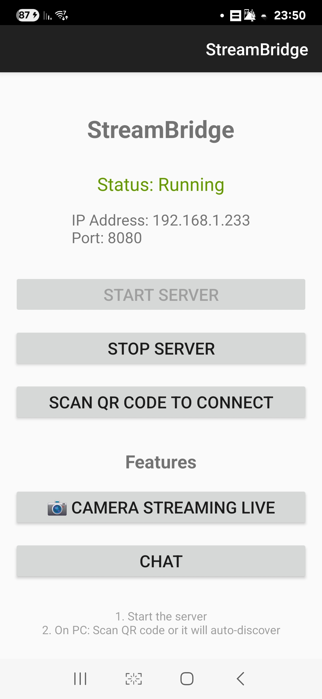
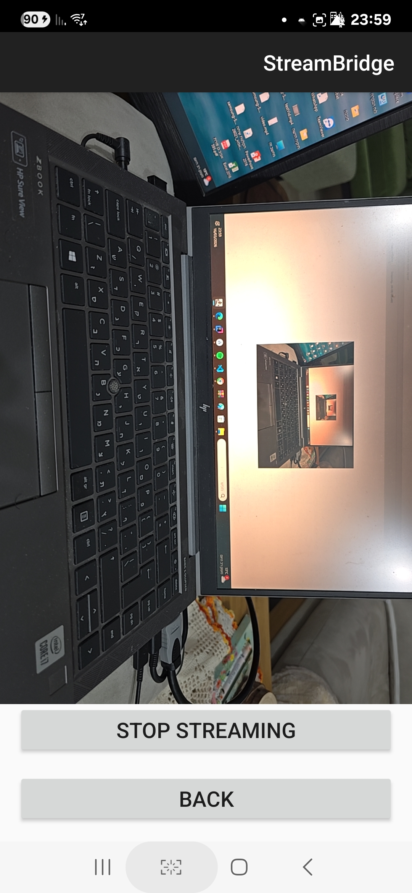
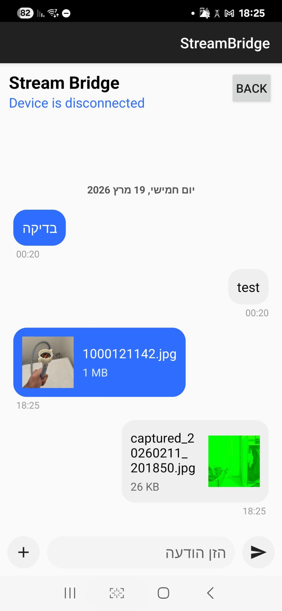

# StreamBridge – Android Server

StreamBridge is a secure real-time communication system that connects an Android phone with a Windows PC over a local network (LAN).

This repository contains the **Android server application**, written in Kotlin.  
The phone acts as a secure server that allows the PC client to connect and interact with it.

---

---

## Watch the App in Action

---

## 📸 Screenshots

| Server Screen | live camera screen | chat screen | permission screen |
|---|---|---|---|
|  |  | | |

---

## Features

- 📷 **Live camera streaming** using CameraX
- 💬 **Bidirectional real-time messaging** between phone and PC
- 📁 **File transfer** from phone to PC
- 📸 **Instant remote photo capture**
- 🔒 **Secure communication over HTTPS (port 8080) and Websocket secure (port 8081)**
- 🔐 **Strong encryption**
  - TLS 1.3
  - ECDHE Used for key exchange — generates the session encryption keys and Provides forward secrecy — new keys per session
  - ECDSA authentication
  - AES-256-GCM encryption
- 🤝 **Secure first-time pairing (TOFU – Trust On First Use)**

---

## 🧠 Highlights & Mechanics

- **Client–Server Architecture**
  - Android phone acts as the **secure server**
  - Windows desktop application acts as the **client**

- **Secure Communication Pipeline**
  1. Client connects via HTTPS
  2. WebSocket secure (WSS) channel established
  3. Authentication using ECDSA
  4. Key exchange using ECDHE
  5. Messages encrypted using AES-256-GCM

- **TOFU Pairing Model**
  - First connection stores the peer public key
  - Future connections verify the stored key
  - Any key change is treated as suspicious

### Use Cases

- **Live Camera Streaming**
  - Implemented using **CameraX**
  - Frames transmitted in real-time over WebSocket
- **Securely transfer files** (audio files, documents, photos, videos, contacts and Samsung notes) from phone to computer and vice versa
- Real-time phone–PC communication
- **Remote photo capture** from desktop

---

## Architecture

StreamBridge uses a **client–server architecture over LAN** — no internet connection or cloud service required.

Android Phone (Server) <-- HTTPS / WSS --> Windows PC (Client)

Camera / Files / Messages                Desktop UI

Phone (Android app):
- Runs a local **HTTPS server using NanoHTTPD**
- Provides **WebSocket secure (WSS)** communication
- Streams camera frames
- Handles file transfer and commands

PC (Windows client):
- Desktop application built with **Kotlin + JavaFX**
- Connects to the phone over the local network
- Renders live video frames
- Handles file downloads/uploads and messaging UI

---

## Security

StreamBridge is designed with strong security principles.

### Transport Security

All communication occurs over **HTTPS and WSS** and encrypted using **TLS**.

This ensures:

- encrypted communication
- message integrity
- protection from man-in-the-middle attacks

### Authentication

Authentication is performed using **ECDSA** certificates generated on the phone and verified by the client.

### Key exchange

Key exchange is performed using **ECDHE**, ensuring:

- perfect forward secrecy
- new session keys for every connection

### Data Encryption

Sensitive data is protected with **AES-256-GCM**, providing:

- strong encryption
- authenticated encryption
- tamper protection

### Pairing model

StreamBridge uses **TOFU (Trust On First Use)**.

This means:

- On first connection the PC receives the phone's self-signed certificate and pins it locally
- Every subsequent connection verifies against the pinned certificate — a rogue device on the network cannot impersonate the phone
- Pairing is initiated either by scanning a QR code or via an Auto-Discover prompt that requires explicit acceptance on the phone
- This model is similar to how **SSH** works.

---

## Technologies Used

- **Kotlin**- primary language
- **Android SDK**
- **CameraX** - camera streaming pipeline
- **NanoHTTPD** - embedded HTTPS server
- **java-WebSocket Secure (WSS)**
- **Android Keystore** - private key storage (key never leaves the secure enclave)
- **JmDNS / mDNS** - local network discovery
- **TLS**
- **ECDHE**
- **ECDSA**
- **AES-256-GCM**

---

## 📂 Project Structure

app/
├── src/
│ └── main/
│ ├── AndroidManifest.xml
│ ├── java/dev/streambridge/
│ │
│ │ ├── MainActivity.kt
│ │ ├── MimeUntils.kt
│ │ ├── NetworkUntils.kt
│ │ ├── ChatHistoryStore.kt
│ │ ├── ShareReceiverActivity.kt
│ │ ├── QRScannerActivity.kt
│ │ │
│ │ ├── server/
│ │ │ ├── ServerManager.kt
│ │ │ └── StreamBridgeService.kt
│ │ │
│ │ ├── camera/
│ │ │ └── CameraActivity.kt
│ │ │
│ │ ├── transfer/
│ │ │ └── FileBrowserActivity.kt
│ │ │
│ │ ├── security/
│ │ │ └── CertificateManager.kt
│ │ │
│ │ ├── discovery/
│ │ │└── DiscoveryService.kt
│ │ │
│ │ ├── permission/  
│ │  └── permissionRationaleActivity.kt
│ │  
│ └── res/
│ ├── layout/
│ ├── drawable/
│ └── values/
│
├── build.gradle.kts
├── settings.gradle.kts
└── gradle.properties

---

## First-time pairing

1. Start the StreamBridge app on your phone — the server starts automatically

2. On the Windows client, click **Show QR Code** and scan it with the phone, or click **Auto-Discover Devices**

3. Accept the connection prompt on the phone — the certificate is pinned and all future connections are automatic

---

## Project Status

This project was developed as a personal software project demonstrating:

- Android networking
- secure communication
- real-time streaming
- cross-platform phone–desktop integration

---

## Related Project

The Windows desktop client is implemented separately using **Kotlin + JavaFX**.
